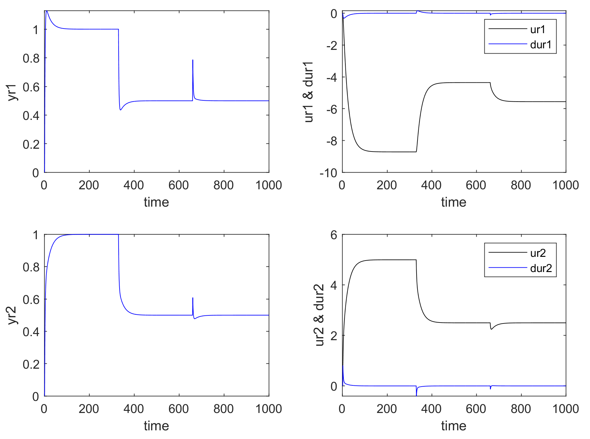

## Description the project.

This code showcases the simulation of a process with Dynamic Control Algorithm developed by Tarcisio S. S. Dantas.

This method was originally proposed by Cutler & Ramaker in the article titled "Dynamic matrix control – a computer
control algorithm" presented at the Joint Automatic Control conference, San Francisco, 1980. The code presented here was based mostly on the article of Garcia & Morshedi, "Quadratic Programming solution of Dynamic Matrix Control", Chemical Engineering Communications, v. 46, p. 073-087, but also on the class notes of Prof. D. Odloak from the University of São Paulo, Brazil, and on the web lecture from R. Sencio (Portuguese) located at https://www.youtube.com/watch?v=dCOaVrLksBQ&t=1402s.

## Requirements and Instruction.

To run this code you need to have installed MATLAB software from [Mathworks](https://www.mathworks.com/)

All the functions are contained in a single .m file

## Main features of the control algorithm

The main features are: 
* **2 Input & 2 Output process described by a generic Transfer Function model, converted to a Step response based space state MIMO model**
* **No restrictions on Input & Output**
* **Prediction Horizon is determined automatically from step response model**

The results from the simulation:

## Licensing information for this project.

This code is licensed under GNU General Public license v3.0

## Contact information

Any questions should be directed to Tarcisio S. S. Dantas at tssdantas@gmail.com
